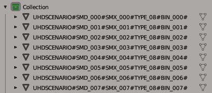

# RE4-SCENARIO-SMD-TOOLS
Extract and repack RE4 OG UHD/PS4/NS/X360/PS3/GC/WII Scenario SMD files

**Translate from Portuguese Brazil**

Programa destinado a extrair e recompactar os cenários usando somente um arquivo .OBJ;
 Nota: Esse repositório contém 4 executáveis, cada um serve para um conjunto de versões:
 -> RE4_UHD_SCENARIO_SMD_TOOL.exe : UHD (PC/STEAM)
 -> RE4_PS4NS_SCENARIO_SMD_TOOL.exe : PS4 e NS
 -> RE4_X360PS3_SCENARIO_SMD_TOOL.exe : X360 e PS3
 -> RE4_GCWII_SCENARIO_SMD_TOOL.exe : GC e WII

## Tutorial
Veja abaixo tutoriais em português de como usar a tool:
 [RE4 UHD Tutorial Editando Scenarios SMD](https://jaderlink.blogspot.com/2023/11/RE4-UHD-TUTORIAL-SCENARIO-SMD.html)
 [RE4 UHD Tutorial Editando r100.SMD](https://jaderlink.blogspot.com/2023/11/RE4-UHD-TUTORIAL-R100-SMD.html)

## Updates

**Update: V.1.3.0**
  * Foi reformulada a tool nessa versão do programa.
  * Adicionado um exe para suportar as versões de GC/WII;
  * Na versão de GC/WII os BIN são centralizados, o que faz com que os BINs repetidos fiquem na posição errada, então você vai ter que recalcular a posição manualmente.
  * Adicionado suporte para arquivos '.SHD';
  * Foi substituído o arquivo 'idxuhdscenario' pelo arquivo 'idxuuscenario'
  * E o arquivo 'idxuhdsmd' pelo arquivo 'idxuusmd', para ter um conteúdo mais simples de editar.
  * O conteúdo dentro do OBJ continua o mesmo, então você pode usar os OBJ gerados com a versão anterior do programa.
  * Feito melhorias na tool, e outras novidades. 

## RE4_\*\*_SCENARIO_SMD_TOOL.exe

Programa destinado a extrair e reempacotar os arquivos de cenário SMD do RE4 OG UHD/PS4/NS/X360/PS3/GC/WII;

## Extract:

Use o bat: "RE4_\*\*_SCENARIO_SMD_TOOL_Extract_all_scenario_SMD.bat"
 Nesse exemplo, vou usar o arquivo: r204_004.SMD
 Ao extrair, serão gerados os arquivos:
 * "r204_004.scenario.idxuuscenario" ou "r204_004.scenario.idxggscenario" // arquivo importante de configurações, para o repack usando o .obj;
 * "r204_004.scenario.idxuusmd" ou "r204_004.scenario.idxggsmd" // arquivo importante de configurações, para o repack usando os arquivos '.BIN';
 * "r204_004.scenario.obj" // Conteúdo de todo o cenário, esse é o arquivo que você vai editar;
 * "r204_004.scenario.mtl" // Arquivo que acompanha o .obj;
 * "r204_004.scenario.idxmaterial" // conteúdo dos materiais (alternativa ao uso do .mtl);
 * "r204_004.scenario.idxuhdtpl" // representa o arquivo .tpl, presente no '.smd' exceto na versão GC/WII;
 * "r204_004.TPL" // Conteúdo do TPL presente no SMD, somente na versão GC/WII;
 * "r204_004_BIN\" //pasta contendo os arquivos ".BIN" (e os '.TPL', exceto na versão GC/WII);

## Repack:

Existem duas maneiras de fazer o repack.
 * Usando o arquivo '.idxuuscenario' ou '.idxggscenario', o repack será feito usando o arquivo '.obj';
 * Usando o arquivo '.idxuusmd' ou '.idxggsmd', o repack será feito com os arquivos '.bin' da pasta "r204_004_BIN";
 Nota: Os arquivos '.idxggscenario' e '.idxggsmd' são específicos da versão de GC/WII;
 E os arquivos '.idxuuscenario' e '.idxuusmd' são para as outras versões;

## Repack com '.idxuuscenario' para UHD/PS4/NS/X360/PS3

Use o bat: "RE4_\*\*_SCENARIO_SMD_TOOL_Repack_all_with_idxuuscenario.bat";
 Nesse exemplo, vou usar o arquivo: "r204_004.scenario.idxuuscenario";
  que vai requisitar os arquivos:
 * r204_004.scenario.obj (obrigatório);
 * r204_004.scenario.mtl OU r204_004.scenario.idxmaterial + r204_004.scenario.idxuhdtpl;

Ao fazer o repack, serão gerados os arquivos:
 * "r204_004.SMD" (esse é o arquivo para ser colocado no .udas);
 * "r204_004.scenario.Repack.idxmaterial";
 * "r204_004.scenario.Repack.idxuhdtpl";
 * "r204_004.scenario.Repack.idxuusmd";
 * "r204_004_REPACK\" //pasta contendo os novos arquivos '.BIN' e o novo '.TPL'; (aviso: ele sobrescreve os arquivos);

## Repack com '.idxggscenario' somente para GC/WII

Use o bat: "RE4_GCWII_SCENARIO_SMD_TOOL_Repack_all_with_idxggscenario.bat";
 Nesse exemplo, vou usar o arquivo: "r204_004.scenario.idxggscenario";
  Que vai requisitar os arquivos:
 * r204_004.scenario.obj (obrigatório);
 * r204_004.TPL (obrigatório)
 * r204_004.scenario.mtl OU r204_004.scenario.idxmaterial;

Ao fazer o repack, serão gerados os arquivos:
 * "r204_004.SMD" (esse é o arquivo para ser colocado no .das);
 * "r204_004.scenario.Repack.idxggsmd";
 * "r204_004_REPACK\" //pasta contendo os novos arquivos '.BIN'; (aviso: ele sobrescreve os arquivos);

## Repack com '.idxuusmd' para UHD/PS4/NS/X360/PS3

Use o bat: "RE4_\*\*_SCENARIO_SMD_TOOL_Repack_all_with_idxuusmd.bat";
 Nesse exemplo, vou usar o arquivo: "r204_004.scenario.idxuusmd";
  Que vai requisitar os arquivos:
 * Os arquivos '.BIN' e '.TPL' da pasta "r204_004_BIN";

Ao fazer o repack, será gerado o arquivo:
 * "r204_004.SMD" (esse é o arquivo para ser colocado no .udas);

Nota: esse é o método antigo, no qual se edita os bin individualmente, porém o repack com .idxuuscenario cria novos bin modificados, e um novo .idxuusmd, no qual pode ser usado para fazer esse repack; essa opção é para caso você queira colocar um .bin no .smd que o programa não consiga criar.

## Repack com '.idxggsmd' somente para GC/WII

Use o bat: "RE4_GCWII_SCENARIO_SMD_TOOL_Repack_all_with_idxuusmd.bat";
 Nesse exemplo, vou usar o arquivo: "r204_004.scenario.idxggsmd";
  Que vai requisitar os arquivos:
 * r204_004.TPL (obrigatório)
 * Os arquivos '.BIN' da pasta "r204_004_BIN";

Ao fazer o repack, será gerado o arquivo:
 * "r204_004.SMD" (esse é o arquivo para ser colocado no .das);

## Sobre r204_004.scenario.obj

Esse arquivo é onde está todo o cenário, nele os arquivos BIN são separados por grupos, no qual a nomenclatura deve ser respeitada:
 
  *Exemplo:*
  **UHDSCENARIO#SMD_000#SMX_000#TYPE_08#BIN_000#**
  **UHDSCENARIO#SMD_001#SMX_001#TYPE_08#BIN_001#**
 
  *OU:*
  **UHDSCENARIO\_SMD\_000\_SMX\_000\_TYPE\_08\_BIN\_000\_**
  **UHDSCENARIO\_SMD\_001\_SMX\_001\_TYPE\_08\_BIN\_001\_**
 
 Aviso: no lugar de 'UHDSCENARIO' também pode ser:
 * UUSCENARIO
 * GGSCENARIO
 * MAINSCENARIO

Sendo:
 * É obrigatório o nome do grupo começar com "UHDSCENARIO" ou "UUSCENARIO" ou "GGSCENARIO" ou "MAINSCENARIO", e ser dividido por # ou _
 * A ordem dos campos não pode ser mudada;
 * SMD_000 -> esse é o ID da posição da Entry/Line no '.SMD', a numeração é em decimal;
 * SMX_000 -> esse é o ID do SMX, veja o arquivo '.SMX',  a numeração é em decimal;
 * TYPE_08 -> esse é um valor em hexadecimal que representa flags, veja mais abaixo sobre.
 * BIN_000 -> esse é o id do bin que será usado, para bin repetidos, será considerado somente o primeiro, (o próximo com o mesmo id, será usado o mesmo modelo que do primeiro).
 * o nome do grupo deve terminar com # ou _ (pois, após salvo o arquivo, o Blender coloca mais texto no final do nome do grupo);

----> Sobre verificações de grupos:
  * No Repack se ao lado direito do nome do grupo aparecer o texto "The group name is wrong;", significa que o nome do grupo está errado, e o seu arquivo SMD vai ficar errado;
  * E se ao lado direito aparecer "Warning: Group not used;" esse grupo está sendo ignorado pelo meu programa. Caso, na verdade, você gostaria de usá-lo, você deve arrumar o nome do grupo;

**Editando o arquivo .obj no Blender**
 No importador de .obj marque a caixa "Split By Group" que está no lado direito da tela.
 Com o arquivo importado, cada objeto representa um arquivo .BIN
 

**Ao salvar o arquivo**
 Marque as caixas "Triangulated Mesh" e "Object Groups" e "Colors".
 No arquivo .obj o nome dos grupos vai ficar com "_Mesh" no final do nome (por isso, no editor, termina o nome do grupo com # para evitar problemas);

## Sobre os arquivos que começam com IDX
Segue abaixo a lista de comandos mais importantes presente no arquivo:

**Configurações Gerais:**
  * Magic:0040 // O valor do magic é oculto por padrão, e seu valor padrão é 0040, somente alguns valores são permitidos;
  * ExtraParameter_?:0 // caso o Magic for 0140, vão existir esses campos, que representam a quantidade de SMD Entry em cada um dos SMDs que estão dentro dos DAT (isso só existe no R100 onde usa o sistema de BLK)
  * SmdFileName:r204_004.SMD // esse é o nome do arquivo SMD que será gerado;
  * TplFileName:r204_004.TPL // esse é o nome do arquivo TPL que será colocado dentro do SMD; (somente na versão de GC/WII)
  * BinFolder:r204_004_BIN // esse é o nome da pasta onde serão salvos ou estão os arquivos .BIN (e o arquivo .TPL, exceto no GC/WII);
 * UseIdxUhdTpl:false // usa o conteúdo de UseIdxUhdTpl para forçar a ordem dos Ids dos TplEntry ao fazer o repack (campo somente no idxuuscenario);
 * UseIdxMaterial:false // Caso ativado, será o usado o arquivo '.idxmaterial' (e '.idxuhdtpl') ao invés do '.mtl' para fazer o repack (campo somente no idxuuscenario e idxggscenario);
 * EnableVertexColor:false // (Recomendo manter como false) Se ativado, cria os bins com o campo de "Vertex Color", mas o .obj não tem um suporte adequado para isso (campo somente no idxuuscenario e idxggscenario);
 * EnableDinamicVertexColor:true // o mesmo que o de cima, porém só vai criar o campo "Vertex Color" somente para os bins que realmente têm pintura de vértices. (campo somente no idxuuscenario e idxggscenario);

**Configuração Por SMD Entry**
  * SMD_000 // define um novo SMD entry, onde 000 é o ID do SMD, tudo o que vier abaixo dele vai ser referente a esse SMD entry, até que apareça outro SMD_001, podem estar em qualquer ordem, mas não repita a numeração.
  * PositionX:0.0 // posição X do bin na cena. 
  * PositionY:0.0 // posição Y do bin na cena. 
  * PositionZ:0.0 // posição Z do bin na cena. 
  * AngleX:0.0 // ângulo de rotação X do bin na cena.
  * AngleY:0.0 // ângulo de rotação Y do bin na cena.
  * AngleZ:0.0 // ângulo de rotação Z do bin na cena.
  * ScaleX:1.0 // escala X do bin na cena.
  * ScaleY:1.0 // escala Y do bin na cena.
  * ScaleZ:1.0 // escala Z do bin na cena.
  * TplFileID:0 // define o arquivo TPL associado ao arquivo bin, no arquivo 'idxggscenario' caso o valor desse campo seja zero, esse campo é omitido (no 'idxuuscenario' esse campo não é usado).
  // Por exemplo, se o nome do arquivo TPL for 'r204_004.TPL', para o TplFileID de ID 1 o nome do arquivo deve ser 'r204_004.1.TPL' e o de ID 2 deve ser 'r204_004.2.TPL', os valores aqui são em decimal.

**Os campos abaixo somente estão presentes no arquivo idxuusmd/idxggsmd**
  * BinFileID:0 // diz qual arquivo 'BIN' é usado (valor em decimal).
  * SmxID:0 // diz qual 'SMX' é usado e é vinculado ao arquivo 'SMX' (valor em decimal).
  * ObjectStatus:08 // valor em hexadecimal, é o mesmo que o campo "TYPE" no OBJ, veja mais abaixo sobre;
  // os campos abaixo são ocultos por padrão:
  * FixedFF:FF // sempre FF valor em hexadecimal
  * Unused1:0 // sempre 0 valor em hexadecimal
  * Unused2:0 // sempre 0 valor em hexadecimal
  * Unused3:0 // sempre 0 valor em hexadecimal
  * Unused4:0 // sempre 0 valor em hexadecimal
  * Unused5:0 // sempre 0 valor em hexadecimal
  * Unused6:0 // sempre 0 valor em hexadecimal
  * Unused7:0 // sempre 0 valor em hexadecimal

**Campos expecificos do idxuur100repack e idxggr100repack**
 * SharedFileName:r100_005.SMD // nome do SMD Shared
 * ExtraSmdFileName_?:r100_00_000.SMD // nome do SMD que faz parte do "SMD EXTRA"
 * ExtraTplFileName_?:R100.FILE_0.TPL // nome do TPL que vai dentro do "SMD EXTRA" (somente em 'idxggr100repack', opcional)

**Configuração Por SMD Entry para SMD_EXTRA**
 * FILE_00_SMD_000 // faz o mesmo que o "FILE_00_SMD_000" porem também define o ID do File Extra, é vinculado a entry do 'obj' que começa com FILE_00#SMD_000 

 ## sobre ObjectStatus / TYPE
Esse campo é um enum bitflag, isso significa que cada bit tem uma função, segue abaixo do que cada um faz:
   * 0x00 / 0b00000000 // nenhuma flag ativada.
   * 0x?1 / 0b?0001 // "EXE Scripted", contém evento associado ao modelo, não o remova do SMD
   * 0x?2 / 0b?0010 // Desconhecido, não usado no jogo.
   * 0x?4 / 0b?0100 // "Assign SMX Group ID"
   * 0x?8 / 0b?1000 // "Ends SMX Group, Has SMX(?)"
   * 0x1? / 0b0001? // "Use BIN from shared SMD (BLK)": Representa um BIN presente no SharedSMD;
   * 0x2? / 0b0010? // "Use TPL from shared SMD (BLK)": não funciona no jogo.
   * 0x4? / 0b0100? // "Use MOT from shared SMD (BLK)": MOT não funciona / não é usado.
   * 0x8? / 0b1000? // Desconhecido, não usado no jogo.
   // Outros valores são combinações dessas funcionalidades, veja bit a bit para saber o que faz.

# sobre .idxmaterial e .idxuhdtpl
Veja sobre em [RE4-UHD-BIN-TPL-TOOLS](https://github.com/JADERLINK/RE4-UHD-BIN-TPL-TOOLS);

# sobre '.idxr100extract' e '.idxuur100repack' ou 'idxggr100repack'
Para extrair o cenário, coloque os arquivos '.SMD' necessários ao lado de .idxr100extract;
  Nota: No tópico **tutorial** tem um tutorial sobre como editar o r100;

## Código de terceiro:

[ObjLoader by chrisjansson](https://github.com/chrisjansson/ObjLoader):
Encontra-se no RE4_SCENARIO_SMD_TOOLS\\CjClutter.ObjLoader.Loader, código modificado, as modificações podem ser vistas aqui: [link](https://github.com/JADERLINK/ObjLoader).

**At.te: JADERLINK**
 Thanks to \"mariokart64n\" and \"CodeMan02Fr\"
 Material information by \"Albert\"
 2025-10-25